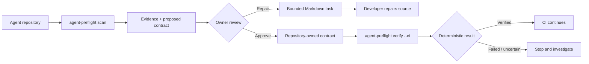

# Agent Preflight

### Turn agent permissions into a contract before they become a production surprise.

[](https://github.com/pratikforge/agent-preflight/actions/workflows/agent-preflight-ci.yml)
[](https://www.rust-lang.org/)
[](https://openai.devpost.com/)

Agent Preflight is a local, repository-owned CLI for agentic software. It statically checks whether direct, documented approval and permission controls are present in an agent codebase, records the evidence, and lets the owner approve a capability contract before CI verifies it again.

It is deliberately conservative: aliases, wrappers, callbacks, generated settings, or runtime behavior that prevent proof produce `CannotVerifyStatically`. Uncertainty never becomes a green result.

## The 60-second idea



The demo is concrete: an effectful tool starts without a proven approval control, the CLI reports source evidence, the owner approves the intended capability, the source is repaired, and `verify --ci` changes from failed to verified without the CLI editing customer code.

## Why this exists

Agent frameworks make it easy to declare tools. It is harder to prove, before execution, that consequential tools have the approval or permission boundary the owner intended. Observability products answer what happened at runtime; Agent Preflight answers a narrower preflight question:

> Does this repository contain source-level evidence for the capability controls its owner approved?

## Supported direct contracts

| Adapter | Direct controls currently understood |
| --- | --- |
| OpenAI Agents SDK (Python) | `function_tool(needs_approval=True)`, `Agent.as_tool(..., needs_approval=True)`, local MCP `require_approval="always"`, Shell/ApplyPatch approval, hosted MCP approval |
| Google ADK (Python) | `FunctionTool(..., require_confirmation=True)` and explicit false/uncertain outcomes |
| Claude Agent SDK (TypeScript, TSX, Python) | literal `dontAsk` with an allow-list, read-only `plan` mode, and explicit `bypassPermissions` failure |

The adapters are framework-specific, but the stored capability contract is framework-neutral.

## What it does not do

- Does not import or execute the scanned repository.
- Does not invoke agents, tools, subprocesses, models, or network calls from the scanned repository.
- Does not silently edit source code or CI configuration.
- Does not claim a repository is secure, compliant, or production-ready.
- Does not replace runtime evaluations, tracing, or threat modeling.
- Does not guess through dynamic configuration or unresolved wrappers.

## Quick start

Requirements: Rust `1.97.1` with `rustfmt` and `clippy`.

```bash
git clone https://github.com/pratikforge/agent-preflight.git
cd agent-preflight/agent-preflight
cargo +1.97.1 build --release --locked
./target/release/agent-preflight scan /path/to/your-agent-repository
./target/release/agent-preflight verify /path/to/your-agent-repository --ci
```

On Windows PowerShell, use `target\\release\\agent-preflight.exe`.

## CLI workflow

```bash
agent-preflight scan /path/to/repository
agent-preflight review /path/to/repository
agent-preflight approve /path/to/repository CAP-001
agent-preflight task /path/to/repository CAP-001
agent-preflight verify /path/to/repository --ci
```

Artifacts stay inside the scanned repository’s `.agent-preflight/` directory:

```yaml
artifacts:
  contract.yaml: owner-approved_capability_contract
  evidence.yaml: findings_and_parse_error_locations_only
  report.md: bounded_human_readable_summary
  tasks/: repair_handoffs_without_source_edits
  result.yaml: deterministic_ci_result
```

## Exit-code contract

| Code | Meaning |
| ---: | --- |
| `0` | Completed or verified |
| `1` | Approved control failed verification |
| `2` | Invalid input or contract state |
| `3` | Unsupported repository/profile |
| `4` | Cannot verify statically / parse uncertainty |
| `5` | Internal failure |

## Testing and quality gates

```bash
cargo +1.97.1 fmt --manifest-path agent-preflight/Cargo.toml --check
cargo +1.97.1 test --manifest-path agent-preflight/Cargo.toml --locked
cargo +1.97.1 clippy --manifest-path agent-preflight/Cargo.toml --locked --all-targets --all-features -- -D warnings
cargo +1.97.1 deny --manifest-path agent-preflight/Cargo.toml check
cargo +1.97.1 audit --file agent-preflight/Cargo.lock
cargo +1.97.1 build --manifest-path agent-preflight/Cargo.toml --release --locked
```

The suite covers adapter contracts, parser boundaries, malformed input, path escape, symlink rejection, size/depth limits, deterministic artifacts, redacted evidence, and CI exit codes. GitHub Actions runs the same release checks on Ubuntu, macOS, and Windows.

## Codex and GPT-5.6 collaboration

This project was built and hardened with Codex and GPT-5.6 during OpenAI Build Week. Codex was used to decompose the product, ground adapter rules in official documentation, implement the Rust parser and adapters, generate adversarial fixtures, drive red-green verification, identify an oversized evidence artifact on a real SDK corpus, and establish cross-platform quality gates.

Human decisions remained explicit: product boundary, supported direct syntax, uncertainty policy, non-goals, release scope, and final acceptance. Supply the relevant Codex session evidence and `/feedback` Session ID in the Devpost submission rather than storing private session data here.

## Repository layout

```text
agent-preflight/
├── src/                 Rust CLI, domain model, parser, adapters, verifier
├── tests/               Unit, integration, security, and fixture tests
├── fixtures/            Direct, dynamic, malformed, and demo repositories
├── scripts/             Matching-platform release-fixture runners
└── docs/                Demo and limitation notes
.github/workflows/       Three-OS quality and packaging workflow
```

## Scope and limitations

This is a bounded static-analysis release baseline. Runtime authorization behavior, arbitrary data-flow resolution, unsupported languages, and generated policy are intentionally outside the current proof boundary. Read [the limitations](agent-preflight/docs/limitations.md) before relying on a result.

## License and contribution

Agent Preflight is available under the [MIT License](LICENSE). Contributions must preserve the no-execution boundary, add a source-grounded fixture for each new direct rule, and keep `CannotVerifyStatically` conservative.

## Build Week context

Agent Preflight targets OpenAI Build Week’s **Developer Tools** category: it is a working local developer tool with a reproducible test path, installation instructions, cross-platform CI, and a concrete end-to-end demonstration. Confirm current deadlines and requirements on the [official Devpost rules](https://openai.devpost.com/rules) before submitting.
