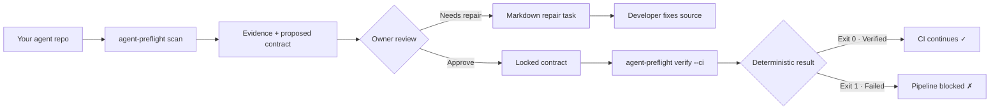

# Agent Preflight

### Turn agent permissions into a contract — before they become a production surprise.

[](https://github.com/pratikforge/AGENT-PREFLIGHT_CLI/actions/workflows/agent-preflight-ci.yml)
[](https://www.rust-lang.org/)
[](LICENSE)

---

## The Problem

AI agent frameworks make it trivially easy to declare powerful tools — tools that can delete users, execute shell commands, write files, or call external APIs. But there is **no standard way to prove, before execution**, that those tools have the human-approval controls the repository owner intended.

Observability products tell you what happened at runtime. **Agent Preflight answers a different question:**

> Does this repository contain source-level evidence for the capability controls its owner approved?

---

## The Solution

Agent Preflight is a **local, zero-dependency CLI** that statically scans an agent codebase for permission and approval controls, records source-level evidence, and lets the repository owner approve a capability contract — all **without ever executing the scanned code**.

It is deliberately conservative: if it can't prove a control exists through direct source patterns, the result is `CannotVerifyStatically`. **Uncertainty never becomes a green result.**


### Robust Multi-file Scan Aggregation & Posture Checks
- **Intelligent Deduplication:** Aggregates repeated rule statuses across the entire repository instead of spamming with redundant findings. Evaluators run per source for whole-project context and per-file for CI YAML logic, outputting precise deduplicated evidence artifacts.
- **Fail-Closed Safe Readers:** Robust traversal that securely analyzes hidden folders (like \.github/workflows\) while strictly avoiding path traversal escapes, symlink attacks, and enforcing strict depth and size limits.
- **CI/CD Security Posture:** Beyond just agent Python/TS logic, Agent Preflight evaluates configuration files to flag insecure continuous integration postures.

### Advanced Agent Protection Capabilities

Beyond static analysis, Agent Preflight now introduces an embedded **Runtime Protection Layer**:
- **Cryptographic Runtime Approvals**: Intercept agent execution with canonical request digest verification, cryptographic nonce tracking to prevent replays, and strict policy-revision bindings.
- **Redacted Append-Only Audit Trail**: A tamper-evident, cryptographically chained audit log (SHA-256) that fails-closed upon write failures and guarantees no raw secrets or PII leak into the logs.
- **Generic Pre-Execution Guard**: Wrappers that sit between the agent framework and the actual tool executor, guaranteeing that unapproved or unrecognized capabilities are explicitly blocked *before* execution happens.



---


## End-to-End Walkthrough

Here's a concrete example. Imagine you have an OpenAI Agents SDK project with this tool:

```python
# agent.py — a dangerous tool with NO approval control
from agents import function_tool

@function_tool
def delete_user() -> None:
    pass
```

### Step 1 — Scan the repository

```bash
agent-preflight scan ./my-agent-repo
# scan complete: openai-agents-sdk (1 file)
```

This creates a `.agent-preflight/` directory inside your repo with three files:

| File | Purpose |
| --- | --- |
| `evidence.yaml` | Exactly where in your source code each finding was located |
| `contract.proposed.yaml` | A proposed capability contract, waiting for your review |
| `report.md` | A short human-readable summary of the scan |

### Step 2 — Review pending capabilities

```bash
agent-preflight review ./my-agent-repo
# Pending capability rules:
# - openai-function-tool-approval: cannot_verify_statically
```

The tool found `delete_user()` is decorated with `@function_tool` but has **no `needs_approval=True`** — so it flags it as unverifiable.

### Step 3 — Approve the contract

As the repository owner, you explicitly approve the rule to lock it into your contract:

```bash
agent-preflight approve ./my-agent-repo openai-function-tool-approval
# approved `openai-function-tool-approval`
```

### Step 4 — Run the CI verification gate

```bash
agent-preflight verify ./my-agent-repo --ci
# Exit code: 1  ← verification FAILED
```

The CI gate **correctly blocks** the pipeline. You approved the rule, but the source code still doesn't have the required approval control.

### Step 5 — Fix the source code

Add the approval flag to your tool:

```diff
- @function_tool
+ @function_tool(needs_approval=True)
  def delete_user() -> None:
      pass
```

### Step 6 — Re-scan and verify

```bash
agent-preflight scan ./my-agent-repo
agent-preflight approve ./my-agent-repo openai-function-tool-approval
agent-preflight verify ./my-agent-repo --ci
# Exit code: 0  ← verification PASSED ✓
```

The contract now matches the source. CI continues.

> **Key point:** Agent Preflight never edited your code. It told you what was missing, you fixed it, and the tool verified the fix. That's the entire product loop.

---

## Installation

### Option A — Terminal Installation (Recommended)

You can download and install the pre-compiled binaries for **Windows**, **macOS**, and **Linux** directly from your terminal.

**Windows (PowerShell):**
```powershell
irm https://raw.githubusercontent.com/pratikforge/AGENT-PREFLIGHT_CLI/main/install.ps1 | iex
```

**macOS / Linux (Bash):**
```bash
curl -fsSL https://raw.githubusercontent.com/pratikforge/AGENT-PREFLIGHT_CLI/main/install.sh | bash
```

These scripts will download the latest release and install it to your local path.

### Option B — Build from source

Requires [Rust 1.97.1](https://www.rust-lang.org/tools/install) with `rustfmt` and `clippy`.

```bash
git clone https://github.com/pratikforge/AGENT-PREFLIGHT_CLI.git
cd AGENT-PREFLIGHT_CLI
cargo +1.97.1 build --release --locked
```

The binary will be at `target/release/agent-preflight` (or `target\release\agent-preflight.exe` on Windows).

---

## CLI Commands

```bash
# Scan a repository and generate evidence + proposed contract
agent-preflight scan <repository-path>

# List capabilities waiting for owner review
agent-preflight review <repository-path>

# Approve a specific capability rule into the contract
agent-preflight approve <repository-path> <rule-id>

# Generate a Markdown repair task for a failed finding
agent-preflight task <repository-path> <rule-id>

# Run the deterministic CI verification gate
agent-preflight verify <repository-path> --ci
```

All artifacts are stored inside the scanned repository at `.agent-preflight/`:

```
.agent-preflight/
├── contract.yaml        # Owner-approved capability contract
├── evidence.yaml        # Source-level findings (file, line, column)
├── report.md            # Human-readable scan summary
├── result.yaml          # Deterministic CI verification result
└── tasks/               # Repair task handoffs (no source edits)
```

---

## Supported Frameworks

| Framework | Language | Direct controls detected |
| --- | --- | --- |
| **OpenAI Agents SDK** | Python | `@function_tool(needs_approval=True)`, `Agent.as_tool(..., needs_approval=True)`, local MCP `require_approval="always"`, Shell/ApplyPatch approval, hosted MCP approval |
| **Google ADK** | Python | `FunctionTool(..., require_confirmation=True)` and explicit `False`/uncertain outcomes |
| **Claude Agent SDK** | TypeScript, TSX, Python | Literal `dontAsk` with an allow-list, read-only `plan` mode, explicit `bypassPermissions` failure |

The adapters are framework-specific, but the stored capability contract is **framework-neutral**.

---

## What It Does Not Do

This tool has an intentionally narrow scope:

- ❌ Does **not** import or execute the scanned repository
- ❌ Does **not** invoke agents, tools, subprocesses, models, or network calls
- ❌ Does **not** silently edit source code or CI configuration
- ❌ Does **not** claim a repository is bulletproof, compliant, or enterprise-grade
- ❌ Does **not** replace runtime evaluations, tracing, or threat modeling
- ❌ Does **not** guess through dynamic configuration, wrappers, or generated code

---

## Try It Yourself — Built-in Demo

The repository ships with before/after demo fixtures so you can try the full workflow without any external dependencies:

```bash
# Copy the "before" fixture to a temp directory
cp -r fixtures/demo/openai_before /tmp/demo-repo

# Run the full workflow
agent-preflight scan /tmp/demo-repo
agent-preflight review /tmp/demo-repo
agent-preflight approve /tmp/demo-repo openai-function-tool-approval
agent-preflight verify /tmp/demo-repo --ci    # ← Exits 1 (FAIL)

# Now manually add needs_approval=True in /tmp/demo-repo/agent.py
# Then re-scan and verify:
agent-preflight scan /tmp/demo-repo
agent-preflight approve /tmp/demo-repo openai-function-tool-approval
agent-preflight verify /tmp/demo-repo --ci    # ← Exits 0 (PASS ✓)
```

On **Windows PowerShell**, replace `cp -r` with `Copy-Item -Recurse` and use `agent-preflight.exe`.

---

## Exit Codes

Deterministic exit codes make CI integration straightforward:

| Code | Meaning |
| ---: | --- |
| `0` | Completed or verified |
| `1` | Approved control failed verification |
| `2` | Invalid input or contract state |
| `3` | Unsupported repository / profile |
| `4` | Cannot verify statically / parse uncertainty |
| `5` | Internal failure |

---

## Repository Layout

```
.
├── src/
│   ├── adapters/       # Framework-specific static analysis (OpenAI, ADK, Claude)
│   ├── app/            # Application commands (scan, review, approve, verify, task)
│   ├── domain/         # Core domain model and capability contract types
│   ├── infra/          # Bounded filesystem reader with depth/size/symlink limits
│   └── render/         # Output formatting and report generation
├── tests/              # 15 test suites: adapters, parser, security, fixtures, CLI
├── fixtures/           # 60+ fixtures: direct, dynamic, malformed, demo repos
├── scripts/            # Cross-platform CI fixture evaluation runners
└── docs/               # Demo walkthrough and limitation notes
.github/workflows/      # Three-OS CI: Ubuntu, macOS, Windows
```

---

## Testing & Quality Gates

The project enforces strict quality gates across all three platforms in CI:

```bash
cargo fmt --check                 # Code formatting
cargo clippy -- -D warnings       # Lint with zero warnings
cargo test --locked               # Full test suite
cargo deny check                  # Dependency license & advisory audit
cargo audit                       # Known vulnerability scan
cargo build --release --locked    # Release build verification
```

The test suite covers adapter contracts, parser boundaries, malformed input, path traversal escape, symlink rejection, size/depth limits, deterministic artifact output, redacted evidence, CI exit codes, and cross-platform fixture evaluation.

---

## Scope & Limitations

This is a **bounded static-analysis tool**. It is intentionally conservative:

- Runtime authorization behavior is outside the proof boundary
- Arbitrary data-flow resolution is not attempted
- Unsupported languages and generated policy produce uncertainty
- Aliases, wrappers, and dynamic configuration result in `CannotVerifyStatically`

Read the full [limitations](docs/limitations.md) before relying on a result.

---

## License

Agent Preflight is available under the [MIT License](LICENSE). Contributions must preserve the no-execution boundary, add a source-grounded fixture for each new rule, and keep `CannotVerifyStatically` conservative.
