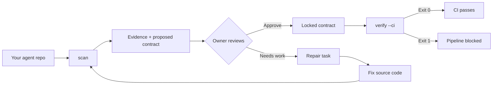

<p align="center">
  <h1 align="center">Agent Preflight</h1>
  <p align="center">
    <strong>The missing security layer for autonomous AI agents.</strong>
  </p>
  <p align="center">
    Scan. Approve. Guard. Audit. — Before your agent touches production.
  </p>
</p>

<p align="center">
  <a href="https://github.com/pratikforge/AGENT-PREFLIGHT_CLI/actions/workflows/agent-preflight-ci.yml"></a>
  <a href="https://www.rust-lang.org/"></a>
  <a href="LICENSE"></a>
</p>

---

## What is Agent Preflight?

Agent Preflight is a **zero-dependency CLI tool** that brings end-to-end security governance to AI agent codebases. It works in two layers:

1. **Static Analysis** — Scans your agent's source code for permission and approval controls, generates source-level evidence, and lets you lock a capability contract — all without ever executing the scanned code.

2. **Runtime Protection** — Embeds pre-execution guards, cryptographic approval verification, network egress control, and tamper-evident audit logging directly into your agent's execution pipeline.

> **The core principle:** If Agent Preflight can't *prove* a control exists through direct source evidence, the result is `CannotVerifyStatically`. Uncertainty never becomes a green light.

### Supported Agent Frameworks

| Framework | Language | What it detects |
| --- | --- | --- |
| **OpenAI Agents SDK** | Python | `@function_tool(needs_approval=True)`, `Agent.as_tool(...)` approval, local/hosted MCP approval, Shell/ApplyPatch controls |
| **Google ADK** | Python | `FunctionTool(..., require_confirmation=True)` and explicit False/uncertain outcomes |
| **Claude Agent SDK** | TypeScript, Python | `dontAsk` with allow-lists, read-only `plan` mode, `bypassPermissions` detection |

---

## Key Features

### Deep Static Analysis
- **Typed Source-to-Sink Flow Tracking** — Traces data from untrusted sources (user input, web content) through templates and wrappers all the way to privileged sinks (system prompts, shell execution). Not regex — real inter-procedural flow analysis.
- **Prompt Injection Detection** — Catches direct overrides, base64-encoded payloads, multilingual role-play attacks, and tool-output injection paths before they reach high-impact actions.
- **Intelligent Multi-file Aggregation** — Deduplicates findings across the entire repository. One violation, one finding — not a wall of noise.

### Runtime Protection Layer
- **Pre-Execution Guards** — SDK-specific wrappers for OpenAI, Claude, and Google ADK that physically intercept tool calls and block unapproved actions *before* execution. Not logging — blocking.
- **Cryptographic Approval Claims** — Every approval is bound to a policy revision, caller identity, request digest, and time window. Single-use nonces prevent replay attacks.
- **Network Egress Control** — Runtime DNS resolver guard that blocks connections to private IP ranges, cloud metadata endpoints (169.254.x.x), and detects DNS-rebinding attacks.

### Tamper-Evident Auditing
- **Hash-Chained Audit Trail** — Every execution decision is recorded in an append-only log chained via SHA-256. Modify or delete a record and the chain breaks — instantly detectable.
- **Zero-Leakage Redaction** — Raw arguments, API keys, and PII are structurally redacted and replaced with stable fingerprints before touching storage. The system fails closed if an audit write fails.

### Supply Chain and CI Governance
- **Deterministic SBOM Generation** — Parses lock files, manifests, workflows, and container definitions to produce byte-stable Software Bills of Materials.
- **CI/CD Posture Checks** — Flags unpinned GitHub Actions, missing OIDC, overly permissive tokens (`write-all`), and unprotected workflows.
- **Advisory Integration** — Cross-references dependencies against known vulnerability databases.

---

## Installation

### Option A — One-Line Install (Recommended)

**Windows (PowerShell):**
```powershell
irm https://raw.githubusercontent.com/pratikforge/AGENT-PREFLIGHT_CLI/main/install.ps1 | iex
```

**macOS / Linux:**
```bash
curl -fsSL https://raw.githubusercontent.com/pratikforge/AGENT-PREFLIGHT_CLI/main/install.sh | bash
```

### Option B — Build from Source

Requires [Rust 1.97.1+](https://www.rust-lang.org/tools/install).

```bash
git clone https://github.com/pratikforge/AGENT-PREFLIGHT_CLI.git
cd AGENT-PREFLIGHT_CLI
cargo build --release --locked
```

The binary will be at `target/release/agent-preflight` (or `agent-preflight.exe` on Windows).

---

## User Guide

### The Workflow

Agent Preflight follows a simple 4-step loop:



### Step 1 — Scan your repository

```bash
agent-preflight scan ./my-agent-repo
```

This generates a `.agent-preflight/` directory containing:

| File | What it contains |
| --- | --- |
| `evidence.yaml` | Exactly where in your source each finding was located |
| `contract.proposed.yaml` | Proposed capability contract for your review |
| `report.md` | Human-readable scan summary |

### Step 2 — Review what was found

```bash
agent-preflight review ./my-agent-repo
```

Lists all pending capability rules and their verification status.

### Step 3 — Approve the contract

As the repository owner, explicitly approve rules you've reviewed:

```bash
agent-preflight approve ./my-agent-repo openai-function-tool-approval
```

### Step 4 — Verify in CI

```bash
agent-preflight verify ./my-agent-repo --ci
```

Returns deterministic exit codes that integrate directly into any CI pipeline.

### Repair Tasks

If a rule fails verification, generate a structured repair task:

```bash
agent-preflight task ./my-agent-repo openai-function-tool-approval
```

This produces a Markdown file describing exactly what needs to change — without ever editing your source code.

---

### Concrete Example

Imagine you have an OpenAI Agents SDK project with a dangerous tool:

```python
# agent.py — no approval control
from agents import function_tool

@function_tool
def delete_user() -> None:
    pass
```

Run the workflow:

```bash
agent-preflight scan ./my-repo
agent-preflight approve ./my-repo openai-function-tool-approval
agent-preflight verify ./my-repo --ci    # Exit 1 (FAIL)
```

The gate correctly blocks your pipeline. Now fix the source:

```diff
- @function_tool
+ @function_tool(needs_approval=True)
  def delete_user() -> None:
      pass
```

Re-scan and verify:

```bash
agent-preflight scan ./my-repo
agent-preflight approve ./my-repo openai-function-tool-approval
agent-preflight verify ./my-repo --ci    # Exit 0 (PASS)
```

> **Agent Preflight never edited your code.** It told you what was missing, you fixed it, and the tool verified the fix.

---

## Exit Codes

Deterministic exit codes make CI integration straightforward:

| Code | Meaning |
| ---: | --- |
| `0` | Verified — all approved controls are present |
| `1` | Failed — an approved control is missing or broken |
| `2` | Invalid input or contract state |
| `3` | Unsupported repository or framework |
| `4` | Cannot verify statically / parse uncertainty |
| `5` | Internal failure |

---

## Project Structure

```
.
├── src/
│   ├── adapters/       # Framework-specific analysis (OpenAI, ADK, Claude)
│   ├── app/            # CLI commands + runtime protection layer
│   ├── domain/         # Core types: contracts, findings, status model
│   ├── infra/          # Bounded filesystem reader with security limits
│   └── render/         # Output formatting and report generation
├── tests/              # 80+ tests across 30+ test suites
├── fixtures/           # 60+ fixtures: direct, dynamic, malformed, demo repos
├── docs/
│   ├── runbooks/       # Incident response guides
│   └── limitations.md  # Honest scope boundaries
└── .github/workflows/  # CI: Ubuntu, macOS, Windows
```

---

## Scope and Limitations

Agent Preflight is intentionally conservative. Be aware of its boundaries:

- Static analysis cannot enforce controls at runtime — deploy the Runtime Protection Layer for that
- Aliases, wrappers, and dynamic configuration result in `CannotVerifyStatically`
- Arbitrary data-flow resolution across module boundaries is not attempted
- Unsupported languages and generated policies produce uncertainty, not false positives

Read the full [limitations document](docs/limitations.md) before relying on results in a critical pipeline.

---

## Documentation

| Resource | Description |
| --- | --- |
| [Limitations](docs/limitations.md) | Honest scope boundaries and what the tool does not do |
| [Policy Update Runbook](docs/runbooks/policy_update.md) | How to update and roll out policy changes |
| [Audit Verification Runbook](docs/runbooks/audit_verification.md) | Verifying audit trail integrity |
| [Approval Compromise Runbook](docs/runbooks/approval_compromise.md) | Incident response for compromised approvals |
| [Rollback Runbook](docs/runbooks/rollback.md) | Rolling back to a previous known-good state |

---

## Contributing

Contributions are welcome! Please ensure your changes:

1. Add a source-grounded fixture for each new rule
2. Keep `CannotVerifyStatically` conservative — uncertainty must never become a green result
3. Pass all quality gates: `cargo fmt --check`, `cargo clippy -- -D warnings`, `cargo test --locked`, `cargo deny check`, `cargo audit`

---

## License

Agent Preflight is available under the [MIT License](LICENSE).
